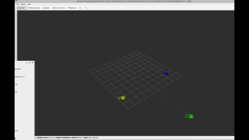

# Pioneer Multi-Robot Testbed

The pioneer multi-robot testbed is platform designed for development and testing of cluster control and adaptive navigation algorithms of land rovers. It can be deployed in a simulation environement or with physical robots with the ability to manually control the robots and change parameters during runtime. The bulk of the codebase is implemented using ROS2 Jazzy and the simulation environment uses Rviz2.

---

## Project Overview

- **Motivation**: To collect extensive field data of cluster control and adaptive navigation algorithms of various cluster configurations.
- **Capabilities**:
  - Implementation of Cluster formation control and Adaptive navigation algorithms.
  - A simulation environment to allow for easy testing of algorithms during development and have a visual representation.
  - Robust pioneer rover platform with automatic script exectution, error handling, and status monitoring.
  - Use configuration files to switch between different cluster configurations from 3-5 robots.
  - User may switch between all modes, modify parameters, and take manual control of robots during runtime.

---

## Demo
Video of 3 robot cluster following contour clockwise in simulation.
<p align="center">
  
</p>
Video of 5 robot cluster moving forward in field.
<p align="center">
  
</p>

## File Structure
Each of the highest level files has an extended read me detailing there purpose and use.
```
~/ros2_ws/
├── Docker/                # Files to launch project in docker container
├── common/                # Custom ROS types and utility classes used throughout
│   ├── gui_package/       # Common GUI utilities (JoyBase, PubSubManager)
│   ├── pioneer_interfaces/# Custom message types
│   └── adaptive_navigation_*/ # Adaptive navigation utilities
├── pioneer_base/          # Base station often run on laptop
│   ├── base_launch/       # Launch files for cluster operations
│   ├── controller/        # Cluster controller
│   ├── teleop_core/       # Teleoperation
│   └── adaptive_nav/      # Adaptive navigation
├── pioneer_ws/            # Pioneer rover platform
│   ├── rover_launch/      # Robot launch files
│   ├── gps_core/          # GPS driver
│   ├── imu_core/          # IMU driver
│   └── locomotion_core/   # Motor control
├── record/                # Logging and graphing data
└── sim/                   # Simulation environment
```

---

## Installation

### Prerequisites

- **OS**: Ubuntu 22.04 or later
- **ROS 2**: Jazzy Jalisco

### System Dependencies

```bash
# Install ROS 2 Jazzy (if not already installed)
sudo apt update
sudo apt install -y ros-jazzy-desktop

# Install additional ROS 2 packages
sudo apt install -y ros-jazzy-xacro
sudo apt install -y ros-jazzy-joint-state-publisher-gui

# Install Python dependencies
sudo apt install -y python3-pip python3-dev
```

### Python Dependencies

```bash
cd ~/ros2_ws
pip3 install -r requirements.txt
```

### Build Workspace

```bash
cd ~/ros2_ws
colcon build --symlink-install
```

### Setup Environment

**IMPORTANT**: You must source the setup file in every new terminal:

```bash
source ~/ros2_ws/install/setup.bash
```

Or add to `~/.bashrc` for automatic sourcing:

```bash
echo "source ~/ros2_ws/install/setup.bash" >> ~/.bashrc
source ~/.bashrc
```

### Verify Installation

```bash
cd ~/ros2_ws
./verify_gui_package.sh
```

All checks should show ✓ if installation is successful.

---

## Quick Start

### 1. Simulation (3 Robots)

```bash
# Source environment
source ~/ros2_ws/install/setup.bash

# Launch 3-robot cluster simulation with visualization
ros2 launch base_launch cluster_3robots.launch.py
```

### 2. Simulation (5 Robots)

```bash
source ~/ros2_ws/install/setup.bash
ros2 launch base_launch cluster_5robots.launch.py
```

### 3. Autonomous Navigation (Simulation)

```bash
source ~/ros2_ws/install/setup.bash
ros2 launch base_launch cluster_autonomous_nav.launch.py use_hardware:=false
```

### 4. Hardware Deployment (3 Robots)

```bash
source ~/ros2_ws/install/setup.bash
ros2 launch base_launch cluster_3robots.launch.py
```

---

## Base Launch Files

The `base_launch` package provides modular launch files for cluster operations:

### Integrated Launch Files (Full System)

| Launch File | Description | Usage |
|-------------|-------------|-------|
| `cluster_3robots.launch.py` | 3-robot cluster with hardware | `ros2 launch base_launch cluster_3robots.launch.py` |
| `cluster_5robots.launch.py` | 5-robot cluster with hardware | `ros2 launch base_launch cluster_5robots.launch.py` |
| `cluster_autonomous_nav.launch.py` | Autonomous navigation (sim/hw) | `ros2 launch base_launch cluster_autonomous_nav.launch.py use_hardware:=false` |

### Modular Component Launch Files

These can be launched individually or combined:

| Launch File | Description | Usage |
|-------------|-------------|-------|
| `cluster_base.launch.py` | Core cluster controller | `ros2 launch base_launch cluster_base.launch.py robot_count:=3` |
| `cluster_autonomous.launch.py` | Adaptive navigation node | `ros2 launch base_launch cluster_autonomous.launch.py` |
| `cluster_visualization.launch.py` | RViz visualization | `ros2 launch base_launch cluster_visualization.launch.py use_hardware:=true` |
| `cluster_teleop.launch.py` | Teleoperation & joystick | `ros2 launch base_launch cluster_teleop.launch.py` |
| `cluster_logger.launch.py` | Data logging to CSV | `ros2 launch base_launch cluster_logger.launch.py` |
| `cluster_simulation.launch.py` | Simulation components | `ros2 launch base_launch cluster_simulation.launch.py use_hardware:=false` |

### Launch Arguments

Common launch arguments:

- `robot_count`: Number of robots (3 or 5) - default: `3`
- `use_hardware`: Use hardware mode instead of simulation - default: `false`
- `use_virtual_joy`: Launch virtual joystick - default: `true`
- `cluster_config`: Custom config file path - default: `''`

### Examples

```bash
# Launch only controller and visualization
ros2 launch base_launch cluster_base.launch.py &
ros2 launch base_launch cluster_visualization.launch.py use_hardware:=false

# Launch 5-robot controller
ros2 launch base_launch cluster_base.launch.py robot_count:=5

# Launch with custom config
ros2 launch base_launch cluster_base.launch.py cluster_config:=/path/to/config.yaml

# Launch hardware mode with visualization
ros2 launch base_launch cluster_visualization.launch.py use_hardware:=true robot_count:=3
```

---

## Configuration

Robot and system parameters are configured in `pioneer_ws/config/system_config.yaml`.

After modifying the configuration, regenerate parameter files:

```bash
cd ~/ros2_ws/pioneer_ws/scripts
./setup.sh --regen-params-only
```

---

## Troubleshooting

### ModuleNotFoundError: No module named 'gui_package'

**Solution**: Source the setup file:
```bash
source ~/ros2_ws/install/setup.bash
```

### Launch file not found

**Solution**: Rebuild and source:
```bash
cd ~/ros2_ws
colcon build --packages-select base_launch --symlink-install
source install/setup.bash
```

### Check Installation

Run the verification script:
```bash
cd ~/ros2_ws
./verify_gui_package.sh
```

---

## Additional Resources

- **CLAUDE.md**: Detailed build commands and system overview
- **GUI_PACKAGE_README.md**: GUI package documentation
- Package-specific READMEs in each subdirectory

